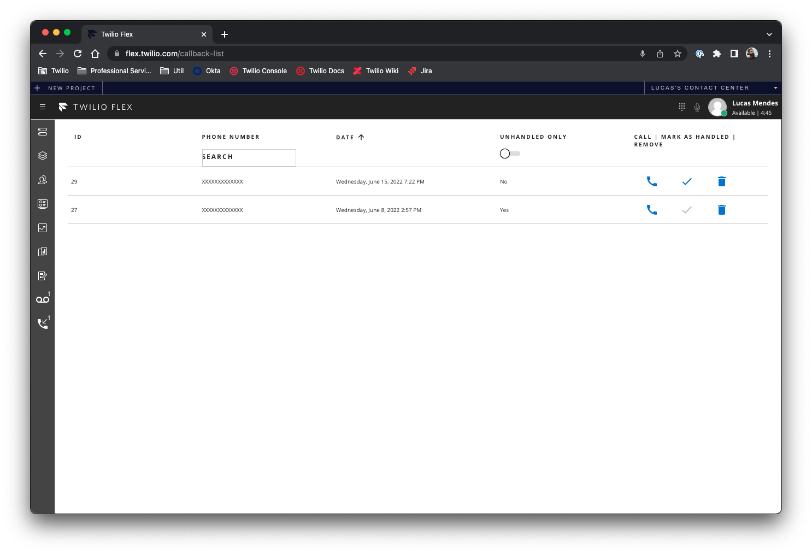

<a  href="https://www.twilio.com">

</a>

# Flex Voicemail/Callback Plugin
This plugin allows you to setup voicemail and callback directories and manage it directly on the Flex UI. This plugin is very flexible and allows you to setup voicemail boxes and callback stores per agent, per workflow, per queue, per team or in any other way that suits better for your use case.

## Requirements
- Flex 1.31+
- Node 14+
- NPM 6.14+
- [Twilio CLI 3.4+](https://www.twilio.com/docs/twilio-cli/quickstart#install-twilio-cli)
- [Flex Plugin for Twilio CLI](https://www.twilio.com/docs/twilio-cli/plugins#available-plugins)
- [Serverless Plugin for Twilio CLI](https://www.twilio.com/docs/twilio-cli/plugins#available-plugins)
- [Twilio CLI Profile configured with your account credentials](https://www.twilio.com/docs/twilio-cli/general-usage#profiles)

## Setup
### Cloning repository
First things first, you need to clone this repository using the following command:
```
$ git clone https://github.com/devsdmf/flex-voicemail-callback-plugin.git
$ cd flex-voicemail-callback-plugin
```

### Installing dependencies
Now, you need to install the dependencies for both the plugin and the server less functions:
```
$ cd voicemail-service/
$ npm install
$ cd ../voicemail-callback-plugin
$ npm install
```

### Configuring and Deploying Serverless Functions

On the `voicemail-service` folder we have our backend services developed using Twilio Serverless functions, these functions are responsible to provide to our plugin a couple of functionalities described below:
- **functions/config.private.js** -> This is a configuration file that is used to store some runtime values
- **functions/helpers.private.js** -> This file contains some helper functions that are used by some other functions to handle tasks, voice calls and other general tasks
- **functions/queue-menu.protected.js** -> This is a function that generates a TwiML for our Studio Flow in order to provide and gather feedback to and from the user, this TwiML contains an interactive menu for the user while he is on hold, as well the hold music URL. Here the user can select to stay on hold, leave a voicemail or request a callback.
- **functions/voicemail.protected.js** -> This is the function responsible to handle the voicemail interaction when the user requests to leave a message, it also returns a TwiML and is responsible to start the recording of the message.
- **functions/voicemail-complete.protected.js** -> This function is responsible to provide the user feedback about the voicemail recording, and is called right after the user finished the recording.
- **functions/voicemail-complete.protected.js** -> This function is responsible to receive the callback from the Programmable Voice service when the recording was processed and is available, then this function stores the voicemail into the voicemail box defined in the task.
- **functions/transcription-complete.protected.js** -> This function is responsible to receive the transcription callback from the Programmable Voice service and updates the voicemail record to include the transcription of the recorded message.
- **functions/callback.protected.js** -> This function is responsible to provide the user feedback about the callback request, allowing the user to specify a different number to be called back.
- **functions/eventstream-handler.protected.js** -> This function will receive Taskrouter events over HTTP and process them accordingly, usually it will be used to send the user to the voicemail when there are no agents available in a given Taskrouter Workflow.
- **functions/create-voicemail-listen-task.js** -> This function will be called from the Flex UI plugin to create a voicemail task in the agent’s UI allowing him to listen to the message and work on that request.

Now we need to setup a few parameters that will be used by our functions. Make a copy of the `.env.sample` to a `.env` file, and edit the parameters on this file according to the list below:
- **ACCOUNT_SID**: The account SID can be found in your Twilio Console’s Dashboard
- **AUTH_TOKEN**: The auth token can be found in your Twilio Console’s Dashboard
- **SYNC_SERVICE_SID**: This is the SID for the default sync service that is used by Flex. You can get this value going into your Twilio Console, on the search bar typing “Sync services” and clicking in the option _Sync services_ under **Sync**. In the screen opened you will probably have at least one service called _Default Service_, this is the service that you need to get the SID.
- **TWILIO_WORKSPACE_SID**: This is the SID for your Flex’s TaskRouter Workspace. You can get it going on your Twilio Console, on the search bar typing “TaskRouter Workspaces” and clicking on the option under **Taskrouter**. It is usually called _Flex Task Assignment_ and the SID is under its name.

After completing the environment variables configuration, we can go forward to the deployment of the functions on our Twilio account, run the following command under the `voicemail-service` folder:

```
$ twilio serverless:deploy
```

The output of this command will print the service domain, save it in a safe place because we will need it in the following step, the output will be something like this:
```
Deploying functions & assets to the Twilio Runtime

Username        SKXXXXXXXXXXXXXXXXXXXXXXXXXXXXXXXX
Password        ********************************
Service SID     ZSXXXXXXXXXXXXXXXXXXXXXXXXXXXXXXXX
Environment     dev
Root Directory  /path/to/flex-voicemail-callback-plugin/voicemail-service
Dependencies    twilio-flex-token-validator
Env Variables   SYNC_SERVICE_SID, TWILIO_WORKSPACE_SID
Runtime         default

✔ Serverless project successfully deployed

Deployment Details
Domain: voicemail-service-XXXX-dev.twil.io
Service:
   voicemail-service (ZSXXXXXXXXXXXXXXXXXXXXXXXXXXXXXXXX)
Environment:
   dev (ZEXXXXXXXXXXXXXXXXXXXXXXXXXXXXXXXX)
Build SID:
   ZBXXXXXXXXXXXXXXXXXXXXXXXXXXXXXXXX
Runtime:
   node14
View Live Logs:
   https://www.twilio.com/console/functions/editor/ZSXXXXXXXXXXXXXXXXXXXXXXXXXXXXXXXX/environment/ZEXXXXXXXXXXXXXXXXXXXXXXXXXXXXXXXX
Functions:
   [private] https://voicemail-service-XXXX-dev.twil.io/config
   [private] https://voicemail-service-XXXX-dev.twil.io/helpers
   [protected] https://voicemail-service-XXXX-dev.twil.io/callback
   [protected] https://voicemail-service-XXXX-dev.twil.io/eventstream-handler
   [protected] https://voicemail-service-XXXX-dev.twil.io/queue-menu
   [protected] https://voicemail-service-XXXX-dev.twil.io/transcription-complete
   [protected] https://voicemail-service-XXXX-dev.twil.io/voicemail
   [protected] https://voicemail-service-XXXX-dev.twil.io/voicemail-complete
   [protected] https://voicemail-service-XXXX-dev.twil.io/voicemail-response
   https://voicemail-service-XXXX-dev.twil.io/create-voicemail-listen-task
Assets:
   https://voicemail-service-XXXX-dev.twil.io/assets/hold_music.mp3
```

### Configuring and Deploying Flex Plugin

After completed the serverless functions setup, we need to deploy the Flex Plugin that will actually provide elements on the Flex UI to manage and handle voicemails and callback requests.
 
On the `voicemail-callback-plugin` folder we have the plugin code, with _components_ for the voicemail list, callback list and voicemail tasks. We also have a couple of _services_ responsible to talk to our backend services as well with some Twilio APIs. Finally, we have the _state_ management code that is responsible to listen to new voicemails and callbacks directly from our Twilio Sync services.

The only configuration that is needed on the plugin side is just the URL for our backend service, so make a copy of the `.env.sample` file to a `.env` file in the root of the `voicemail-callback-plugin` folder and update the variable as described below:

- **FLEX_APP_TWILIO_SERVERLESS_DOMAIN**: The URL of your serverless service created in the previous step, it has the format: https://voicemail-service-XXXX-dev.twil.io

With the configuration done, you can move forward to the deployment of the plugin using the following command:

```
$ twilio flex:plugins:deploy --changelog="First voicemail/callback plugin deployment"
```

The output of this command will be something like the following example, also, it has a *Next steps* section that you need to execute after executing the deployment, so just copy it, paste and run in your terminal:

```
Using profile [profileName] (ACXXXXXXXXXXXXXXXXXXXXXXXXXXXXXXXX)

✔ Validating deployment of plugin plugin-voicemail-callback
✔ Compiling a production build of plugin-voicemail-callback
✔ Uploading plugin-voicemail-callback
✔ Registering plugin plugin-voicemail-callback with Plugins API
✔ Registering version v0.0.1 with Plugins API

🚀 Plugin (private) plugin-voicemail-callback@0.0.1 was successfully deployed using Plugins API

Next Steps:
Run $ twilio flex:plugins:release --plugin plugin-voicemail-callback@0.0.1 --name "Autogenerated Release 1655331171710" --description "The description of this Flex Plugin Configuration." to enable this plugin on your Flex application
```

After running the `twilio flex:plugins:release` command, we are done with the Flex Plugin part, it is already deployed and enabled on your Flex instance.

### Setting Up Voicemail Boxes and Callback Stores
This plugins works based on task and worker attributes, so the definition of where a voicemail or a callback will be stores by a given task or call must be defined in the Twilio Studio Flow in the moment we send the call to Flex using the _Send to Flex_ widget. For the agent side, you will define which voicemail boxes and callback stores a given agent has access through their attributes on Task Router, like explained in the next sections.

### Task Attributes Configuration
In order to store a voicemail message or a callback request, you need to provide the respective repositories (or list names, that’s how it is called in Twilio Sync) using the attributes of the task on the Studio Flow that sends the call to Flex.

Go to **Twilio Console -> Studio -> Flows**, then select the Flow responsible to handle your voice calls. On your _Send to Flex_ widget, you need to specify the attributes `voicemailBox` and `callbackStore` with the name of the respective stores that you want to use for a given task, like the example below:


You can also do this programmatically, using a conditional flow, setting the value into a variable or even getting it from a Twilio Function, its up to you how do you will manage that.

Also, you need to set the Hold Music TWIML URL, and that’s one of the functions that are part of this package, just use the URL of your deployed functions (got in a previous step) and suffix it with the _queue-menu_ path like the example: `https://voicemail-service-XXXX-dev.twil.io/queue-menu?mode=main`.

### Worker Attributes configuration
Now that you already have the voicemail and callback stores defined for tasks, it is time to give access to workers so they can see these requests and work on that. 

The configuration for workers is made through attributes on TaskRouter configuration, go to **Twilio Console -> TaskRouter -> Workspaces -> Flex Task Assignment -> Workers**,  select a worker in the list and the edit window will open. On the _Attributes_ field, you need to add the voicemail box and/or callback stores that the worker will have access, like the example below:


By default, each worker can have only one voicemail inbox and multiple callback stores, but you can change this with a few tweaks in the plugin code if necessary.

Now that your worker has access to the voicemail box and the callback stores, two new icons will show up in the Flex UI, allowing the agent to view and handle the voicemails and callbacks.


### TaskRouter Queues and Events Configuration
In order to process callbacks when your agents are not available we need to setup a _Voicemail_ queue and the event listener on TaskRouter.

Go to Twilio Console -> TaskRouter -> Workspaces -> Flex Task Assignment -> Task Queues. On this screen, click the button with plus sign to add a new Task Queue and fill the form with the following parameters:
- **Task Queue name**: Voicemail
- **Task order**: First In, First Out
- **Reservation activity**: Offline
- **Assignment activity**: Offline
- **Max reserved Workers**: 1
- **Queue expression**: `1 == 2`


Now we need to add this new Task Queue to our Workflow, then click the **Workflows** option on the side bar, select your existing **Workflow** on the list.

On your Routing Steps,  create a new step and the end of the list (becoming your last step) and configure it with the following parameters:
- **Task Queue**: Voicemail (the Task Queue that we created in the previous step)
- **Known Worker**: None
- **Expression**: Empty
- **Ordering**: Longest Idle
- **Skip Timeout**: Do not skip
- **Timeout**:  None
- **Priority**: Inherit


Now you need to create a new filter by clicking in the button `+ Add a filter` in the bottom of the page, then configure it with the following parameters:
- **Filter Name**: Voicemail
- **Matching Tasks**: `type == 'voicemail'`
- **Routing Steps Configuration**:
	- **Task Queue**: Voicemail (the Task Queue that we created in the previous step)
	- **Known Worker**: None
	- **Expression**: Empty
	- **Ordering**: Longest Idle
	- **Skip Timeout**: Do not skip
	- **Timeout**: None
	- **Priority**: Inherit


And the last step that we need to do, is to configure the TaskRouter Events callback to call our backend service, going to **Settings** on the sidebar, we have a section called **Event Callbacks**, just fill it with the URL of your severless functions suffixing it with the `eventstream-handler` path, like in the example: `https://voicemail-service-XXXX-dev.twil.io/eventstream-handler`.


By adding these two new configurations on your TaskRouter Workflow, when your agents are not available, or if a task doesn’t match any of the filters/logic for your workflow, it will take the user to the Voicemail flow. Any time you want to give the user the ability to send a voicemail, just use the Workflow to send the task to the Voicemail queue, this way, our listener will catch these tasks and perform the necessary logic to give the user the feedback to place the voicemail message.

### Testing

Now we are done, the functions were deployed, the plugin is deployed and enabled, our tasks and workers have the necessary attributes, now it is time to test, just call your Twilio Number and follow the menu of options to place the voicemail message or a callback request.

#### Voicemails


#### Callback Requests


## Disclaimer
This software is to be considered "sample code", a Type B Deliverable, and is delivered "as-is" to the user. Twilio bears no responsibility to support the use or implementation of this software.

## License
This project is licensed under the  [MIT license](LICENSE) , that means that it is free to use, copy and modified for your own intents.


